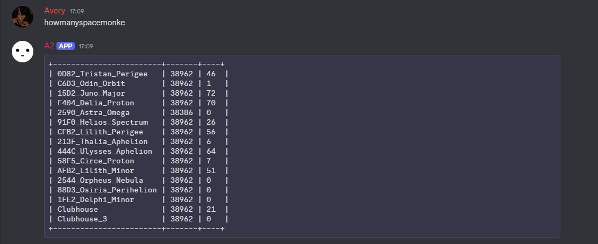

# A2 Discord Bot

This bot is a recreation of the Orion Drift A2 bot that used to serve information about the current players online in each fleet.

## Setup

Basically you can either use the docker image

avery442love/a2-discord-bot

You'll have to setup the environment variables yourself. Check out the start.sh script and it'll teach you what environment variable names you need to set to what.

or you can start it on windows, mac and linux using the start.bat and start.sh scripts. Make sure to modify them to have your required variables set.

## Usage

The bot responds to messages similar to "howmanyspacemonke" with server information.

### Normal Mode
Type `howmanyspacemonke` (or similar) to get a table showing up to 16 servers.

### Bulk Mode
Type `!howmanyspacemonke` (with "!" prefix) to get ALL available servers shown in multiple messages with 16 servers per message. 

**Note:** Bulk mode has a 1-minute cooldown per channel to prevent spam.

## Example Response

## Contributing

Feel free to fork the repository, submit issues, and create pull requests. Contributions are welcome!

